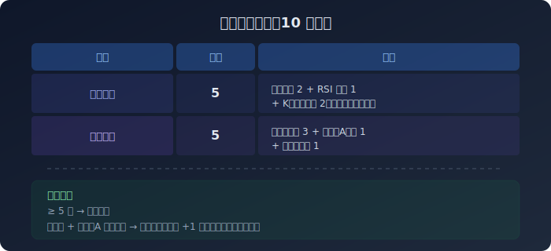

# TrendVision AI

> 基于趋势交易理论的 AI 量化合约分析系统  
> **OKX AI Genesis Hackathon** · #OKXAI

---

## 📌 项目简介

**TrendVision AI** 是一套将经典技术分析理论（趋势交易理论）完整代码化的 AI 量化分析系统。  
只需一条命令，即可获得 AI 对市场的分析结论：**方向、评分、入场区间、止损位**。

**核心理念：用纪律替代感觉，用数据替代冲动。**

---

## 🏆 为什么参赛

传统合约交易最大的问题是：
1. **没有纪律** — 凭感觉开单，逆势扛单
2. **信息过载** — 几十个指标互相矛盾
3. **复盘缺失** — 盈亏不知道为什么

TrendVision AI 用一个**量化评分系统+硬性规则引擎**，把交易者的主观情绪完全关在门外。

---

## 🔧 系统架构

```
┌──────────────────────────────────────────────────────────┐

                          ↓
┌──────────────────────────────────────────────────────────┐
│                   技术分析引擎（趋势交易理论）                   │
│  ┌─────────┐ ┌─────────┐ ┌─────────┐ ┌─────────┐       │
│  │Qjt区间  │ │趋势线   │ │拐点线   │ │分界点A  │       │
│  │升降交替 │ │高低点连 │ │通道平行 │ │前区间边 │       │
│  │嵌套去重 │ │线+突破  │ │线+突破  │ │界突破   │       │
│  └─────────┘ └─────────┘ └─────────┘ └─────────┘       │
│  ┌─────────┐ ┌─────────┐ ┌─────────┐ ┌─────────┐       │
│  │RSI指标  │ │K线形态  │ │波浪计数 │ │ATR波动  │       │
│  │背离检测 │ │13种反转 │ │推动/调整│ │止损参考 │       │
│  └─────────┘ └─────────┘ └─────────┘ └─────────┘       │
└──────────────────────────────────────────────────────────┘
                          ↓
┌──────────────────────────────────────────────────────────┐
│                   信号评分层                                │
│  量化评分 10 分制                                          │
│  基础择时(5分) + 系统工具(5分)                              │
│  4H 方向过滤 → 趋势线+分界点A = 最强信号                    │
│  触发门槛: ≥ 5 分                                          │
└──────────────────────────────────────────────────────────┘
                          ↓
┌──────────────────────────────────────────────────────────┐
│                     输出层                                 │
│  monitor.py — 一条命令 3 秒出结论                          │
│  方向 · 评分 · 入场位 · 止损位 · 关键价位                   │
│  支持持续监控模式（每30分钟自动检查）                        │
└──────────────────────────────────────────────────────────┘
```

---

## 🚀 快速开始

### 环境要求
```bash
Python 3.10+
pip install ccxt python-dotenv requests
```

### 配置
```bash
# 在 .env 文件中配置 API Key
GATE_API_KEY=your_key
GATE_API_SECRET=your_secret
```

### 使用
```bash
# 分析 BTC
python scripts/monitor.py BTC

# 分析 XAUUSD（黄金）
python scripts/monitor.py XAUUSD

# 全品种扫描
python scripts/monitor.py

# 持续监控模式
python scripts/monitor.py --loop
```

---

## 📊 回测数据（真实历史数据）

| 品种 | 量化信号胜率 | 趋势线准确率 | 拐点线准确率 | 分界点A准确率 |
|------|------------|------------|------------|------------|
| **XAUUSD** | **90%** | 67% | **93%** | 71% |
| **BTC** | **81%** | 66% | 81% | **82%** |
| **ETH** | **70%** | 43% | **87%** | 11%* |

> *ETH 分界点A 低准确率已知问题，Qjt 嵌套算法已修复，待验证  
> 4H 方向过滤后 XAUUSD 胜率从 71% → 90%（死规则效果）

---

## 🎯 技术亮点

### 1. 量化评分体系（10分制）


| 类别 | 满分 | 明细 |
|------|------|------|
| 基础择时 | 5 | 价格位置2 + RSI位置1 + K线反转形态2（仅关键位置有效）|
| 系统工具 | 5 | 拐点线突破3 + 分界点A突破1 + 趋势线突破1 |
| **触发门槛** | **≥ 5分** | 趋势线+A点同时突破 = 额外+1，且可无视门槛直接触发 |

### 2. 信号优先级（死规则）
```
趋势线 + 分界点A 同时突破 > 一切
  └── 拐点线 > RSI > K线形态 > 合约辅助数据
```

### 3. 4H 方向过滤（死规则）
```
4H 下降趋势 → 一律不做多
4H 上升趋势 → 一律不做空
无例外。
```
*XAUUSD 回测效果：胜率 71% → 90%，信号数砍半但质量翻倍*

### 4. 硬性风控（三大禁区）
- ❌ 逆势加仓摊薄成本
- ❌ 移动止损调远
- ❌ 单笔超总风险金的 1/10

---

## 🛠 核心算法

| 算法 | 说明 | 实现 |
|------|------|------|
| Qjt 区间分析 | 升降区间交替识别+嵌套去重 | `calc_qjt()` / `dedup_nested()` |
| 趋势线检测 | 关键高低点连线+突破验证 | `find_trendline()` |
| 拐点线通道 | 外延线+平行线+突破检测 | `find_channel()` |
| 分界点A | Qjt区间边界+突破确认 | `find_pivot_a()` |
| K线反转形态 | 13种形态（吞没/十字星等） | `_is_bull_reversal()` / `_is_bear_reversal()` |
| RSI背离 | 顶背离+底背离检测 | `detect_rsi_divergence()` |
| 波浪计数 | 推动浪5波/调整浪3波 | `count_waves()` / `apply_wave_rules()` |
| 仓位计算 | 基于ATR+风险金 | `calc_position_size()` |

---

## 📁 项目结构

```
F:\投资\合约交易\          ← 完整系统代码
├── scripts/
│   ├── monitor.py           # 一键监控（3秒结论）
│   ├── trend_analyzer.py    # 核心分析引擎（~3000行）
│   ├── backtest.py          # 回测引擎
│   ├── chart.py             # K线图表绘制
│   ├── trade_log.py         # 交易日志
│   └── debug_qjt.py         # Qjt调试工具
├── .factory/
│   ├── rules/project.md     # 完整执行规则（20条）
│   ├── skills/luxiwu-trend-trading/  # 趋势交易理论（16章+OCR）
│   └── trades.json          # 交易记录
├── hackathon-okx/           ← 参赛材料
│   ├── README.md            # 本文件
│   ├── index.html           # 产品展示落地页
│   ├── PPT.md               # 参赛演示文档
│   └── 提交指南.md            # 操作步骤
└── books/                   # 相关著作PDF
```

---

## 📺 使用演示（视频脚本）

**30秒演示视频脚本：**
```
[0:00] 打开终端
[0:05] 输入: python monitor.py BTC
[0:10] 展示输出: 评分8/10, 方向做多, 入场位, 止损位
[0:20] 解说: "这是AI给我的分析结论，3秒就知道能不能开单"
[0:25] 输入: python monitor.py --loop
[0:30] 解说: "也可以开着让它自动监控"
```

---

## 📄 License

MIT

---

## 🙏 致谢

- 趋势交易理论（理论基石）
- Gate.io / 华尔街见闻（数据源）
- OKX · X Layer · OKX.AI（黑客松主办）

---

*⚠ 本系统为研究工具，不构成投资建议。交易有风险，决策须谨慎。*  
**#OKXAI · TrendVision AI**


